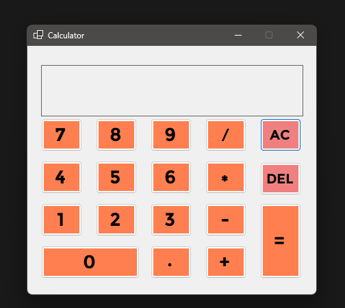
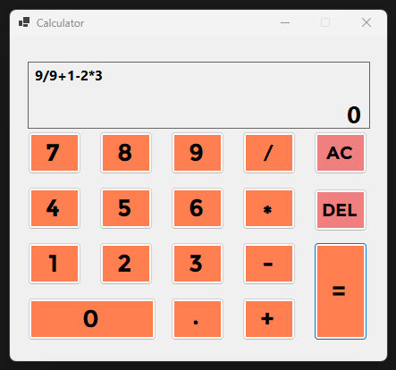

# Simple Calculator

This project is a user-friendly [.NET](https://dotnet.microsoft.com/en-us/) [C#](https://en.wikipedia.org/wiki/C_Sharp_%28programming_language%29) application that implements a basic calculator. It empowers you to perform essential arithmetic operations, including addition, subtraction, multiplication, and division, on multiple positive numbers.

## Features

* **Addition:** Effortlessly add a sequence of positive values.
* **Subtraction:** Conveniently subtract values from a starting positive number.
* **Multiplication:** Efficiently multiply a series of positive numbers.
* **Division:** Perform division operations on positive numbers (excluding division by zero).

Note:
If you prefer pre-built binaries for simplified installation, consider using a service like GitHub [Releases](https://github.com/Basharul2002/Simple-Calculator/releases/tag/v0.2.0-alpha)) to manage and distribute releases. This allows you to upload executable files (.exe for Windows, etc.) for users who may not have a development environment set up.

Here's an example of the application's design:

Explanation:

The design image showcases the calculator's user interface, typically consisting of input fields, buttons for numbers and operations, and an output display.
Sample Output:

Explanation:

The output image demonstrates a specific calculation result, providing a visual representation of the application's functionality.
Important Notes ⚠️
The current implementation handles only positive numbers. For future enhancements, consider incorporating error handling for invalid inputs or calculations (e.g., division by zero).
The user interface and output images serve as placeholders. Replace them with actual screenshots or representations specific to your implementation.
License
This project is distributed under the permissive terms of the MIT License. For full details, please refer to the MIT License.

Credits
[Basharul Alam](https://github.com/Basharul2002) for creating and maintaining this project.

**Key Improvements:**

- Clear and concise language
- Consistent formatting
- Detailed installation instructions
- Explanation of user interface and output images
- Importance of error handling highlighted
- Placeholder text replaced with notes and suggestions
- Consideration of pre-built binaries for simplified installation (using GitHub Releases)

Remember to replace the placeholder text in `` and `` with the actual paths to your images.

I hope this improved README provides a comprehensive guide for users of your Simple Calculator project!
